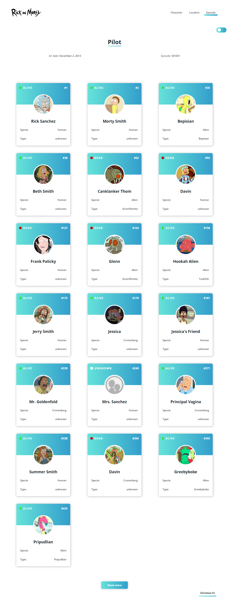
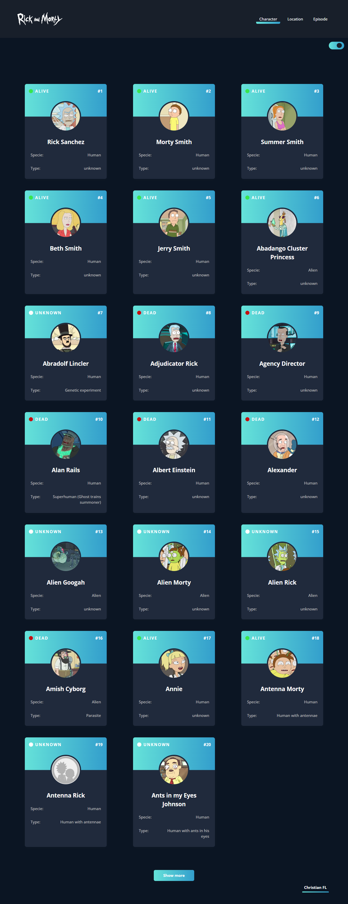

# RICK AND MORTY

Esta es una pequeña practica donde se consume la api de [RickAndMorty](https://rickandmortyapi.com/).

- Se puede observar personajes de la serie por *capitulos*, *locaciones*, y *personajes*.
- Tiene dos temas, **Light**, **Dark**.

## Herramientas utilizadas

- **Fetch**
- **Scss**
- **Animation**